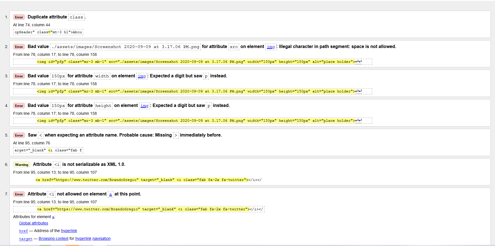
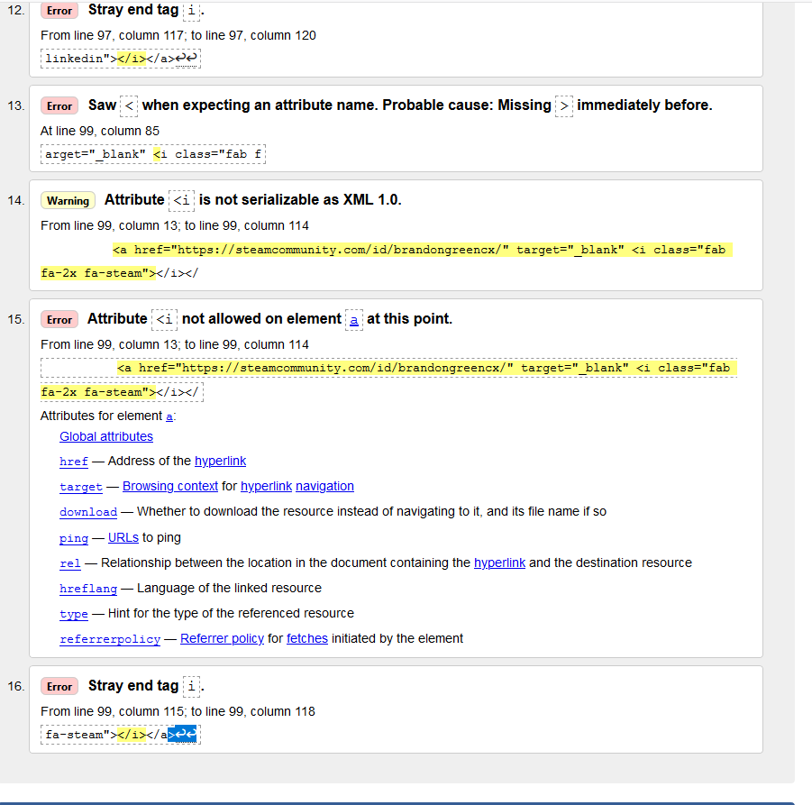
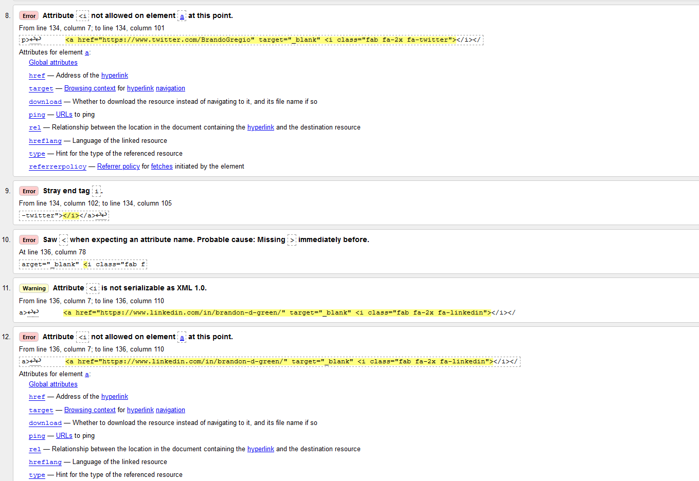
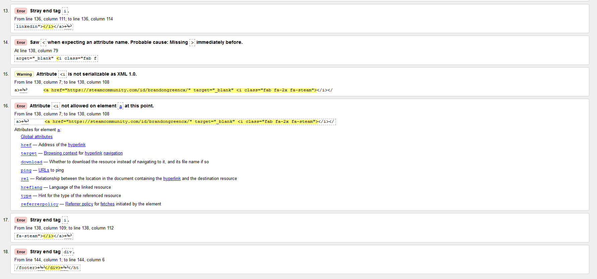
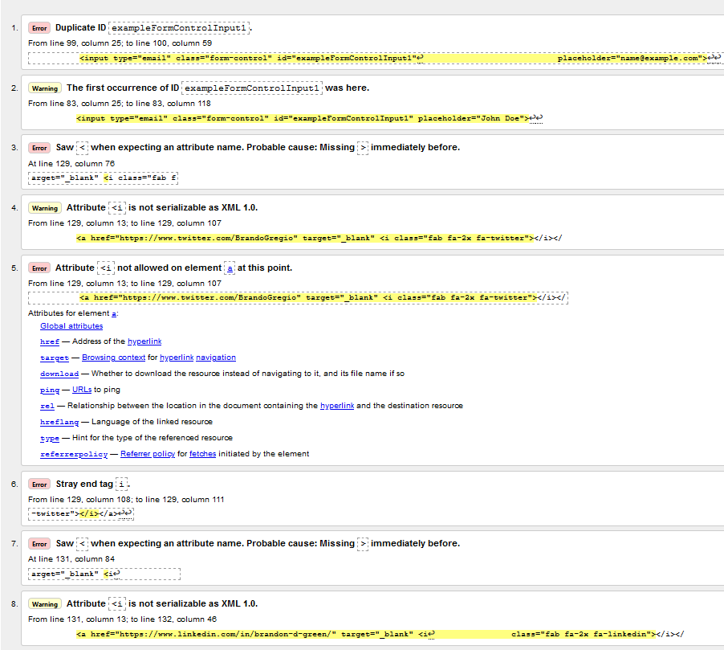
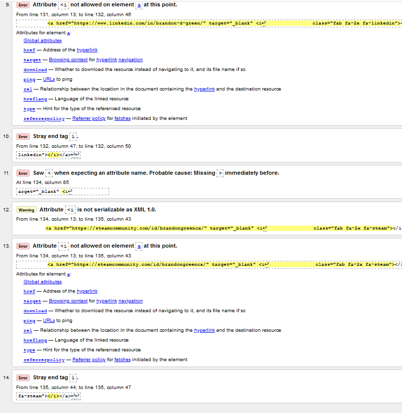

### Name

Responsive_Portfolio

### Description

This is the first portfolio that I have made and it is designed to be similar to another portfolio we were tasked with making. I had to make my own responsive site that responds well to different screen sizes and devices. I made sure to give the site a theme of grey and seagreen to match my last name. I used a variety of HTML, JS from bootstrap, bootstrap grids, and css to style this page. The font is used from google fonts and is referenced in each page.html

### usage

Use this page to learn about me and the projects I've been working on. 

### Project Status

This website will be built on and tweaked. progress is roughly 10% done. There are a couple more months of knowledge to be gained in order to make this site more solid and smooth for employers to view my skill.

### Validation Process

I had to remove <i tags inside my hrefs on every .html

this required removing one at a time and ensureing icons and links still worked.

On some errors such as the second one and other it was simply renaming or redefining something. The error in question the name of the file had spaces and I had to remove them.
